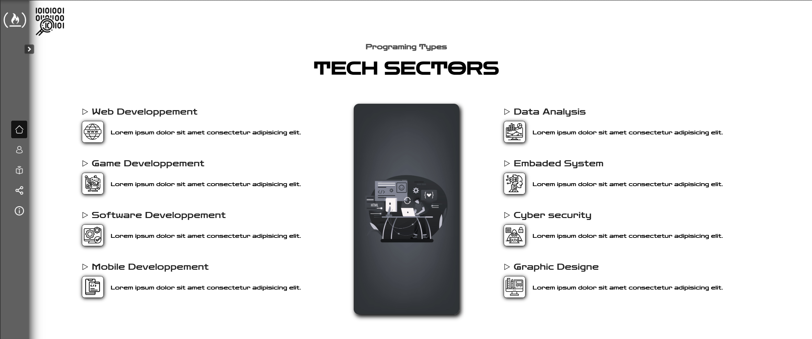
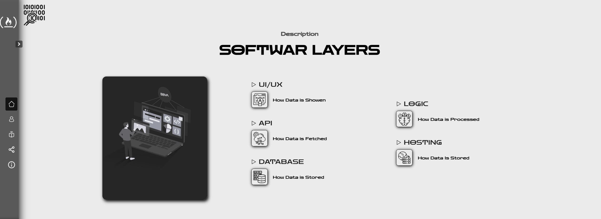

# **TechCamp: Your Ultimate IT Learning Hub** 🚀


Welcome to **TechCamp**, an interactive educational platform designed to help you dive deep into the world of IT. Whether you're just starting out or looking to sharpen your skills, TechCamp provides tutorials, resources, and hands-on practice that will make learning engaging and effective.

## **Why TechCamp?**

TechCamp is built for learners who want to explore:
- **Web Development** 🌐
- **Frontend and Backend Technologies** 💻
- **Data Structures and Algorithms** 🔍
- **UI/UX Design** 🎨

### **Key Features**:
- **Interactive Tutorials**: Step-by-step lessons with live demos.
- **Engaging Visuals**: Clear illustrations and code snippets.
- **Hands-on Coding**: Practice directly within the platform.

## **Technologies Used**

TechCamp leverages the following technologies to create a seamless learning experience:
- **HTML**: The foundation for structure.
- **CSS**: For styling and responsive design.
- **JavaScript**: To bring the tutorials to life with interactivity.
- **GitHub Pages**: Hosting for quick access and sharing.

## **Project Structure**
```plaintext
TechCamp/
│
├── courses/          # Where all course content is stored
├── images/           # Images for better visual appeal
├── Profile.html      # User profile page
├── courses.html      # List of all courses
├── index.html        # Main landing page
├── script.js         # Interactive functionality
└── style.css         # Styling for a modern and clean design
```

## **Installation** 🚀

To run TechCamp locally, follow these steps:

1. **Clone the repository**:
   ```bash
   git clone https://github.com/CodeWizard-404/TechCamp.git
   ```

2. **Navigate to the directory**:
   ```bash
   cd TechCamp
   ```

3. **Open the `index.html` file** in your browser to get started.

## **Contributing** 🤝

We welcome contributions! If you'd like to add more tutorials or improve existing ones, follow these steps:

1. **Fork the repository**.
2. **Create a new branch** for your feature:
   ```bash
   git checkout -b feature-name
   ```
3. **Commit your changes**:
   ```bash
   git commit -am 'Add feature'
   ```
4. **Push to the branch**:
   ```bash
   git push origin feature-name
   ```
5. **Submit a pull request**!

## **Screenshots** 📸






This is just the beginning! Expect more exciting features and tutorials to come soon. Stay tuned and get ready to enhance your IT skills with TechCamp!
